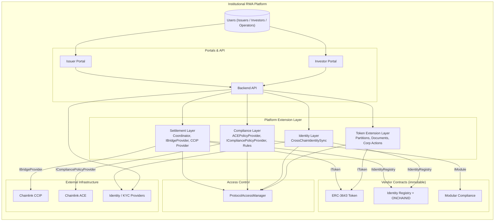
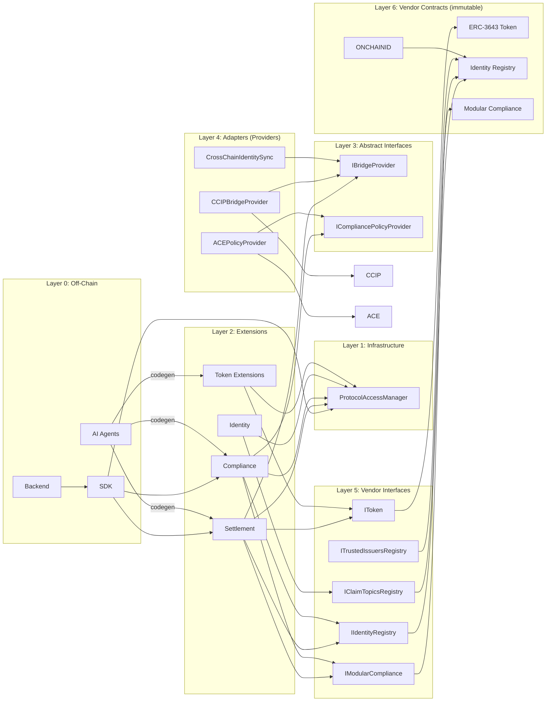

<!--
 Copyright 2026 mohitvaish

 Licensed under the Apache License, Version 2.0 (the "License");
 you may not use this file except in compliance with the License.
 You may obtain a copy of the License at

     https://www.apache.org/licenses/LICENSE-2.0

 Unless required by applicable law or agreed to in writing, software
 distributed under the License is distributed on an "AS IS" BASIS,
 WITHOUT WARRANTIES OR CONDITIONS OF ANY KIND, either express or implied.
 See the License for the specific language governing permissions and
 limitations under the License.
-->
# Extension Architecture

## Purpose

This document defines how the Institutional RWA Platform extends the ERC-3643 (T-REX) and
ONCHAINID ecosystems without modifying upstream contracts. It is the authoritative reference
for every custom module in this repository.

The platform does not fork upstream projects. It does not vendor-modified copies. Every
upstream contract remains a frozen, immutable dependency. All platform-specific behavior
lives in independent extension modules that integrate through public interfaces and
adapter patterns.

---

## Extension Philosophy

### Extend, Never Fork

Forking creates permanent maintenance burden. Every upstream security patch, feature
release, and audit must be manually merged. Over time, forks diverge and become
incompatible with the ecosystem.

By extending instead of forking, the platform:
- Adopts upstream security patches by pointing proxies at new implementation addresses.
- Remains compatible with the broader ERC-3643 ecosystem (wallets, indexers, custodians).
- Reduces audit surface: auditors review only platform-owned code, not vendored modifications.

### Vendor Contracts Are Immutable

Upstream contracts in `vendor/` are never edited. They are treated as third-party
dependencies with the same immutability guarantees as a published npm package or
Go module.

Immutable vendor contracts mean:
- Storage layout is fixed. Platform code never reads vendor storage directly.
- Business logic is fixed. Platform code never calls internal vendor functions.
- Upgrade path is clear. Vendor upgrades = deploy new proxy implementation.

### Composition Over Inheritance

Platform modules do not inherit from vendor contracts. Inheritance couples storage layout,
exposes internal functions, and breaks when upstream contracts change.

Platform modules compose with vendor contracts through:
1. **Interface calls** — platform contracts call vendor contracts through `IIdentityRegistry`,
   `IToken`, `IModularCompliance`.
2. **Adapter wrappers** — platform wraps vendor contracts behind stable internal interfaces.
3. **Compliance modules** — platform implements `IModule` from T-REX and registers with
   `ModularCompliance`.

### Public Interfaces Over Storage Access

Vendor contracts define public interfaces. Platform code reads identity, balance, and
compliance state through these interfaces only. Direct storage reads are forbidden because:
- Storage layout is not part of the vendor contract's public API and may change in upgrades.
- Storage reads bypass access control and event emission.
- Storage coupling creates implicit dependencies that break silently.

### Future Upgrades Remain Possible

Because the platform never modifies vendor contracts:
- Upstream can release a new `Token.sol` implementation; the platform updates its
  proxy pointer and tests compatibility.
- Upstream can change storage layout; platform adapters that use only public interfaces
  need no changes.
- Upstream can deprecate functions; platform detects deprecation at compile time through
  interface changes.

---

## Asset-Centric Domain Model

The platform's architecture models five core domain entities and their relationships.
Every extension module operates on this domain model.

```
Issuer ──1:N──> Asset ──1:N──> Offering ──N:M──> Investor
                        │
                  1:N──> Partition ──1:N──> Holding (per Investor)
                        │
                  1:N──> Document ──1:N──> DocumentVersion
                        │
                  1:N──> Settlement ──1:1──> TransferIntent
```

### Issuer

- Legal entity that issues regulated assets.
- Has one ONCHAINID identity on the canonical chain (replicated to mirror chains).
- Manages assets, offerings, compliance configuration, and document registry.

### Asset

- An ERC-3643 token representing a regulated security or real-world asset.
- Has a single issuer. One issuer may issue multiple assets.
- Has a total supply partitioned into tranches, series, or classes.
- Compliance rules are configured per-asset through `ModularCompliance`.

### Offering

- A specific issuance round or tranche of an asset (e.g., Series A, Tranche 2).
- Has a target raise amount, minimum/maximum investment, investor eligibility
  criteria, and time window.
- An asset may have multiple offerings; an offering belongs to one asset.
- Off-chain construct currently — tracked by the Backend API.

### Investor

- An ONCHAINID identity that holds tokens.
- Has verified claims (KYC, accreditation, jurisdiction, sanctions).
- Has holdings per asset per partition.
- Can participate in offerings and receive corporate actions.

### Holding

- The balance of an asset held by an investor within a specific partition.
- Stored in the ERC-3643 token (total balance) and optionally in
  `PartitionManager` (partition-level breakdown).

### Partition

- An ERC-1400-style balance segregation within an asset.
- Used to represent tranches, lock-ups, or regulatory carve-outs.
- Tracked by `PartitionManager` alongside the ERC-3643 token.

### Settlement

- A cross-chain transfer of an asset from one investor to another.
- Modeled as a `TransferIntent` with two-phase execution (validate then settle).
- Involves canonical-chain burn and mirror-chain mint.

### Document

- Legal, compliance, or asset-specific documents (prospectus, ISIN docs, KYC
  attestations, audit reports).
- Stored as hashed references in `DocumentRegistry`, with off-chain content
  in IPFS or a document management system.

### Domain Model Rules

1. **Issuer owns its assets.** Transferring an asset to another issuer requires
   a new token deployment.
2. **Investors hold assets, not issuers.** Issuers mint and burn, but holdings
   always belong to investor identities.
3. **Partitions are a subdivision, not a separate asset.** All partitions of an
   asset share the same compliance rules and identity requirements.
4. **Settlements bridge canonical and mirror chains.** A settlement is always
   a cross-chain event; same-chain transfers use the standard ERC-3643 flow.
5. **Documents reference off-chain content.** On-chain storage holds only content
   hashes and metadata; the payload is stored off-chain.

---

## Vendor-Owned Components

These components are owned by their upstream projects and must never be modified by
the platform.

### ERC-3643 Token (`Token.sol`)

| Property | Value |
|---|---|
| Responsibility | Regulated asset token: minting, burning, transfers, compliance checks |
| Source | Tokeny T-REX |
| Inherited by platform | Never |
| Wrapped by platform | Yes — via `SettlementCoordinator`, `CCIPBridgeProvider` |
| Modified by platform | Never |

The token is the platform's core asset representation. It is wrapped by bridge adapters
and settlement coordinators that call `mint()` and `burn()` through its public interface.
The platform grants `BURNER_ROLE` and `MINTER_ROLE` to its own contracts so they can
trigger supply changes on behalf of the protocol.

### Identity Registry (`IdentityRegistry.sol`)

| Property | Value |
|---|---|
| Responsibility | Links wallet addresses to ONCHAINID identities |
| Source | Tokeny T-REX |
| Inherited by platform | Never |
| Wrapped by platform | No — called directly through `IIdentityRegistry` |
| Modified by platform | Never |

The platform reads the registry through `IIdentityRegistry` to verify sender and recipient
eligibility. Programmatic identity registration (from cross-chain identity sync) calls the
registry's public `registerIdentity` function directly — no adapter layer is needed because
`IIdentityRegistry` already exposes a stable, canonical interface.

### Claim Topics Registry (`ClaimTopicsRegistry.sol`)

| Property | Value |
|---|---|
| Responsibility | Defines required claim topics for token holders |
| Source | Tokeny T-REX |
| Inherited by platform | Never |
| Read by platform | Yes — through `IClaimTopicsRegistry` in `CrossChainIdentitySync` and compliance modules |
| Modified by platform | Never — governance-only, managed by Compliance Officer |

### Trusted Issuers Registry (`TrustedIssuersRegistry.sol`)

| Property | Value |
|---|---|
| Responsibility | Lists approved claim issuers |
| Source | Tokeny T-REX |
| Inherited by platform | Never |
| Read by platform | No — governance-only, managed by Compliance Officer |
| Modified by platform | Never |

### Modular Compliance (`ModularCompliance.sol`)

| Property | Value |
|---|---|
| Responsibility | Dispatches transfer validation to registered compliance modules |
| Source | Tokeny T-REX |
| Inherited by platform | Never |
| Extended by platform | Yes — platform implements `IModule` and registers with `addModule()` |
| Modified by platform | Never |

This is the primary extension point for platform-specific compliance logic. Platform
compliance modules (`ACEPolicyProvider`, `CrossChainSettlementModule`, `CountryRulesModule`,
`HoldingRulesModule`, `InvestorRulesModule`) implement `IModule` and register with
`ModularCompliance` through its standard public API.

### ONCHAINID (`Identity.sol`, `ClaimIssuer.sol`)

| Property | Value |
|---|---|
| Responsibility | Self-sovereign identity, claim issuance and verification |
| Source | onchain-id/solidity |
| Inherited by platform | Never |
| Wrapped by platform | No — platform calls `registerIdentity` directly through `IIdentityRegistry` |
| Modified by platform | Never |

### TREX Factory (`TREXFactory.sol`)

| Property | Value |
|---|---|
| Responsibility | Orchestrated deployment of the complete T-REX suite |
| Source | Tokeny T-REX |
| Inherited by platform | Never |
| Used by platform | Yes — platform wraps factory for chain-specific deployment |
| Modified by platform | Never |

### Implementation Authority

| Property | Value |
|---|---|
| Responsibility | Points T-REX proxies at current implementations |
| Source | Tokeny T-REX |
| Inherited by platform | Never |
| Interfaced by platform | Via authority address lookup |
| Modified by platform | Never |

---

## Platform-Owned Components

These components are owned by the platform. They live in `protocol/contracts/extensions/`
and are the team's responsibility to design, implement, test, and maintain.

### ProtocolAccessManager

| Property | Value |
|---|---|
| Layer | Foundation |
| Status | Implemented |
| Location | `protocol/contracts/access/` |

Central role registry for all protocol modules. Defines `ISSUER_ROLE`, `AGENT_ROLE`,
`COMPLIANCE_ROLE`, `PAUSER_ROLE`, `UPGRADER_ROLE`, `BRIDGE_ROLE`,
`IDENTITY_MANAGER_ROLE`, `DOCUMENT_MANAGER_ROLE`, `PARTITION_MANAGER_ROLE`,
`CORPORATE_ACTION_ROLE`.

Dependencies: OpenZeppelin `AccessControl`.

Vendor interactions: None.

Depended on by: Every platform module requiring access control.

### SettlementCoordinator (per chain)

| Property | Value |
|---|---|
| Layer | Settlement |
| Status | Specified in `CrossChainSettlementProtocol.md` |
| Location | `extensions/bridge/` |

Orchestrates two-phase cross-chain settlement. Internally decomposed into three
sub-components for separation of concerns:

- **TransferIntentManager:** Manages `TransferIntent` lifecycle, persistent storage,
  and state transitions (`PENDING_VALIDATION` → `VALIDATED` → `SETTLING` →
  `SETTLED` / `ROLLED_BACK`).
- **SettlementExecutor:** Executes validated transfers — burns on source chain,
  mints on destination chain, verifies supply consistency.
- **RecoveryManager:** Handles timeouts, rollbacks, and failed intents. Provides
  `forceRollback()` and `retryIntent()` for recovery operations.

Dependencies: `ProtocolAccessManager`, `IIdentityRegistry`, `IModularCompliance`,
`IToken`, `IBridgeProvider`, `ICompliancePolicyProvider`.

Vendor interactions:
- Calls `IIdentityRegistry.isVerified()` for identity checks.
- Calls `IModularCompliance.canTransfer()` for compliance checks.
- Calls `IToken.burn()` and `IToken.mint()` for supply changes.

### IBridgeProvider

| Property | Value |
|---|---|
| Layer | Settlement |
| Status | Specified in `CrossChainSettlementProtocol.md` |
| Location | `extensions/bridge/providers/` |

Bridge-agnostic interface for cross-chain message transport. Every bridge provider
(CCIP, LayerZero, Hyperlane, Axelar) must implement this interface. The
`SettlementCoordinator` sends Phase 1 validation requests and Phase 2 settlement
instructions through this interface without knowing the underlying bridge.

```solidity
interface IBridgeProvider {
    function sendMessage(
        uint64 destChainSelector,
        address receiver,
        bytes calldata payload
    ) external returns (bytes32 messageId);

    function registerReceiver(
        uint64 sourceChainSelector,
        address sender,
        address receiver
    ) external;
}
```

Dependencies: None — an abstract interface.

Vendor interactions: None — implemented by adapters.

### CCIPBridgeProvider (per chain)

| Property | Value |
|---|---|
| Layer | Settlement |
| Status | Specified in `CrossChainSettlementProtocol.md` |
| Location | `extensions/bridge/providers/ccip/` |

Concrete `IBridgeProvider` implementation for Chainlink CCIP. Handles inbound message
reception (via `CCIPReceiver`) and outbound message sending (via `IRouterClient`).
Validates source authenticity, decodes payloads, and routes to the local
`SettlementCoordinator`.

Dependencies: Chainlink `CCIPReceiver`, `IRouterClient`, `ProtocolAccessManager`,
`SettlementCoordinator`.

Vendor interactions: None directly; routes to `SettlementCoordinator`.

### BridgeCoordination (canonical chain)

| Property | Value |
|---|---|
| Layer | Settlement |
| Status | Specified in `CrossChainArchitecture.md` |
| Location | `extensions/bridge/` |

Canonical-chain coordination contract. Provides retry, rollback, and supply reconciliation.
Mints replacement tokens during rollback when destination mint fails.

Dependencies: `ProtocolAccessManager`, `IToken`, `ChainRegistry`.

Vendor interactions: Calls `IToken.mint()` on the canonical chain.

### ChainRegistry

| Property | Value |
|---|---|
| Layer | Settlement |
| Status | Specified in `CrossChainArchitecture.md` |
| Location | `extensions/bridge/` |

Metadata registry for approved mirror chains. Stores chain selectors, bridge adapter
addresses, token addresses, and active status.

Dependencies: `ProtocolAccessManager`.

Vendor interactions: None.

### ICompliancePolicyProvider

| Property | Value |
|---|---|
| Layer | Compliance |
| Status | Specified in this document |
| Location | `extensions/compliance/` |

Bridge-agnostic interface for compliance policy evaluation. Every policy engine
(ACE, custom Solidity rules, ZK verifier) must implement this interface. The
`SettlementCoordinator` and compliance modules evaluate transfer restrictions
through this interface without coupling to a specific engine.

```solidity
interface ICompliancePolicyProvider {
    function evaluateTransfer(
        address from,
        address to,
        uint256 amount
    ) external view returns (bool allowed, bytes memory reason);

    function evaluateIdentity(
        address identity,
        uint256[] calldata claimTopics
    ) external view returns (bool compliant);
}
```

Dependencies: None — an abstract interface.

Vendor interactions: None — implemented by adapters.

### ACEPolicyProvider (per chain)

| Property | Value |
|---|---|
| Layer | Compliance |
| Status | Specified in `CrossChainArchitecture.md` |
| Location | `extensions/compliance/providers/ace/` |

Concrete `ICompliancePolicyProvider` implementation for Chainlink ACE. Implements
both the platform-defined `ICompliancePolicyProvider` and T-REX `IModule` for
integration with `ModularCompliance`.

Dependencies: `ProtocolAccessManager`, Chainlink ACE `IPolicyRegistry`.

Vendor interactions: Implements `IModule`, registered with `ModularCompliance`.

### CrossChainSettlementModule (per chain)

| Property | Value |
|---|---|
| Layer | Compliance |
| Status | Specified in `CrossChainSettlementProtocol.md` |
| Location | `extensions/compliance/` |

T-REX `IModule` that validates settlement-bound transfers. Checks that the destination
chain is registered, the recipient is verified on the destination, and the transfer is
within holding limits.

Dependencies: `ProtocolAccessManager`, `ChainRegistry`, `IIdentityRegistry`.

Vendor interactions: Implements `IModule`, registered with `ModularCompliance`.

### CountryRulesModule

| Property | Value |
|---|---|
| Layer | Compliance |
| Status | Specified in `Architecture.md` |
| Location | `extensions/compliance/` |

T-REX `IModule` enforcing jurisdiction-based transfer restrictions. Maintains a mapping
of blocked and allowed jurisdictions per token.

Dependencies: `ProtocolAccessManager`.

Vendor interactions: Implements `IModule`, registered with `ModularCompliance`.

### HoldingRulesModule

| Property | Value |
|---|---|
| Layer | Compliance |
| Status | Specified in `Architecture.md` |
| Location | `extensions/compliance/` |

T-REX `IModule` enforcing per-investor balance limits, maximum investor counts, and
concentration limits.

Dependencies: `ProtocolAccessManager`, `IToken` (reads balances).

Vendor interactions: Implements `IModule`, registered with `ModularCompliance`,
calls `IToken.balanceOf()`.

### InvestorRulesModule

| Property | Value |
|---|---|
| Layer | Compliance |
| Status | Specified in `Architecture.md` |
| Location | `extensions/compliance/` |

T-REX `IModule` enforcing KYC, accreditation, and sanctions-related checks via
identity claim verification.

Dependencies: `ProtocolAccessManager`, `IIdentityRegistry`, `IClaimTopicsRegistry`.

Vendor interactions: Implements `IModule`, registered with `ModularCompliance`,
reads identity state.

### CrossChainIdentitySync

| Property | Value |
|---|---|
| Layer | Identity |
| Status | Specified in `CrossChainArchitecture.md` |
| Location | `extensions/compliance/` |

CCIP receiver that relays verified identity proofs and claims from the canonical chain
to mirror chains. Ensures an investor verified on the canonical chain can be recognized
on mirror chains without repeating KYC. Relays issuer identity claims, investor claim
additions, and identity status updates.

Dependencies: `IBridgeProvider`, `ProtocolAccessManager`, `IIdentityRegistry`,
`IClaimTopicsRegistry`.

Vendor interactions: Calls `registerIdentity()`, reads `IIdentityRegistry.isVerified()`
and `IClaimTopicsRegistry.getClaimTopics()`.

### PartitionManager

| Property | Value |
|---|---|
| Layer | Token Extension |
| Status | Specified in `Architecture.md` |
| Location | `extensions/partitions/` |

ERC-1400 inspired partitioned balance tracking. Maintains balance books per partition
per address. Operates alongside the ERC-3643 token, not inside it.

Dependencies: `ProtocolAccessManager`, `IToken` (for total supply sanity checks).

Vendor interactions: Reads token balances through `IToken`.

### DocumentRegistry

| Property | Value |
|---|---|
| Layer | Token Extension |
| Status | Specified in `Architecture.md` |
| Location | `extensions/documents/` |

Stores hashed references to asset, issuer, compliance, and investor-facing documents.
Supports versioning, lifecycle management, and role-gated access.

Dependencies: `ProtocolAccessManager`.

Vendor interactions: None.

### CorporateActions

| Property | Value |
|---|---|
| Layer | Token Extension |
| Status | Specified in `Architecture.md` |
| Location | `extensions/corporate/` |

Asset lifecycle events: distributions, redemptions, splits, conversions, recalls.
Coordinates with `PartitionManager` for partition-aware actions.

Dependencies: `ProtocolAccessManager`, `IToken`, `PartitionManager`.

Vendor interactions: Calls `IToken.mint()`, `IToken.burn()`, `IToken.transfer()`.

### IssuerFactory

| Property | Value |
|---|---|
| Layer | Deployment |
| Status | Not yet implemented |
| Location | `extensions/factories/` |

Platform-specific deployment orchestration. Wraps `TREXFactory` to deploy the full
T-REX suite plus platform extensions in a single transaction. Manages implementation
authority updates.

Dependencies: `TREXFactory`, `ProtocolAccessManager`.

Vendor interactions: Calls `TREXFactory.deployTREXSuite()`.

### SDK

| Property | Value |
|---|---|
| Layer | Off-Chain |
| Status | Not yet implemented |
| Location | `sdk/` |

TypeScript/JavaScript library for interacting with platform contracts. Provides
typed interfaces for settlement, identity, compliance, partitions, documents,
and corporate actions.

Dependencies: Platform contract ABIs, ethers/viem, vendor contract ABIs.

Vendor interactions: Generates calls to vendor contracts through ABIs.

### Backend API

| Property | Value |
|---|---|
| Layer | Off-Chain |
| Status | Not yet implemented |
| Location | `backend/` |

Coordinates off-chain workflows. Manages identity verification off-ramps, compliance
policy configuration, bridge operator dashboards, and monitoring/reconciliation.

Dependencies: SDK, off-chain identity/KYC providers, Chainlink CCIP monitoring APIs.

Vendor interactions: Reads vendor contract events through SDK.

### AI Agent Platform

| Property | Value |
|---|---|
| Layer | Off-Chain |
| Status | Bootstrapped |
| Location | `agents/` |

Prompt-based agent system for contract implementation, review, and testing. Provides
context-aware prompts that enforce architecture rules during code generation.

Dependencies: Project documentation, prompt templates in `agents/prompts/`.

Vendor interactions: None — agents generate platform-owned code only.

---

## Extension Rules

These rules are mandatory for all platform-owned code.

### Rule 1: Never Modify Vendor Contracts

The `vendor/` directory is read-only. No platform commit ever changes a file in
`vendor/erc3643/`, `vendor/onchainid/`, or `vendor/openzeppelin/`.

Violation detection: CI enforces that `git diff -- vendor/` is empty on every PR.

### Rule 2: Never Read Vendor Storage

Platform contracts access vendor state exclusively through public or external functions.
Direct storage reads (`sload`, storage pointer casts) targeting vendored storage layouts
are forbidden.

### Rule 3: Never Inherit from Vendor Contracts

Platform contracts must not inherit from vendor contracts. Composition and adapters
are the only permitted integration patterns.

Exception: T-REX `IModule` interface implementation is not inheritance; it is an
interface conformance required by the vendor's compliance dispatch pattern.

### Rule 4: Use Public Interfaces Only

Every interaction with a vendor contract must go through its Solidity interface:
- `IIdentityRegistry` for identity lookups
- `IToken` for token operations
- `IModularCompliance` for compliance checks
- `IClaimTopicsRegistry` for claim topics
- `ITrustedIssuersRegistry` for trusted issuers

### Rule 5: Abstract Interfaces for External Integrations

Every external system (CCIP, ACE, future bridge providers, identity providers, policy
engines) must be integrated through a platform-defined abstract interface. Concrete
providers implement that interface and translate between the platform abstraction and
the external system's API.

- **Platform interfaces**: `IBridgeProvider`, `ICompliancePolicyProvider`.
- **Concrete providers**: `CCIPBridgeProvider`, `ACEPolicyProvider`.
- **Business logic depends on the abstract interface**, never on concrete providers.
  `SettlementCoordinator` calls `IBridgeProvider`, not `CCIPBridgeProvider`.

### Rule 6: Independent Deployability

Every extension module must be deployable independently. No extension should require
another extension to be present at deployment time, unless it explicitly depends on
it (see Dependency Architecture).

### Rule 7: Independent Upgradeability

Every extension module must use its own UUPS upgradeable proxy. Upgrades to one
extension must never require upgrades to another extension.

### Rule 8: Backward Compatibility with ERC-3643

Platform extensions must never require changes to ERC-3643 or ONCHAINID. A standard
T-REX suite deployment must be usable with the platform without modification.

### Rule 9: Event Emission for State Changes

Every meaningful state change in a platform-owned contract must emit an event.
Events must be indexed where practical for off-chain monitoring.

### Rule 10: Role-Gated Access

All privileged operations must be gated through `ProtocolAccessManager` roles.
Hardcoded addresses are forbidden. Role checks must use `hasRole()` calls.

### Rule 11: No Business Logic Duplication

If logic exists in a vendor contract, platform code must not re-implement it.
Platform code composes with vendor logic through calls, not duplication.

### Rule 12: Immutable ProtocolAccessManager Reference

All platform contracts that use access control must accept a `ProtocolAccessManager`
address at construction or initialization. The reference must be immutable or
upgradeable only through a controlled proxy pattern.

---

## Dependency Architecture

### Layer Hierarchy

```text
                        ┌──────────────────────┐
                        │   AI Agent Platform  │
                        │   (code generation)  │
                        └──────────────────────┘
                                │ generates
                                ▼
┌─────────────────────────────────────────────────────────────┐
│                     Backend API / SDK                       │
│           (off-chain coordination, monitoring, UI)          │
└─────────────────────────────────────────────────────────────┘
                                │ calls
                                ▼
┌─────────────────────────────────────────────────────────────┐
│                   Platform Extensions                        │
│                                                              │
│  ┌──────────┐ ┌──────────┐ ┌──────────┐ ┌─────────────────┐ │
│  │Settlement│ │Compliance│ │ Identity │ │ Token Extensions │ │
│  │Coord.    │ │Modules   │ │ Sync     │ │ (Partitions,     │ │
│  │IBridge   │ │(ACE      │ │          │ │  Documents,       │ │
│  │Provider  │ │Policy,   │ │          │ │  Corp Actions)   │ │
│  │CCIP Prov │ │Country,  │ │          │ │                  │ │
│  │          │ │Investor) │ │          │ │                  │ │
│  └────┬─────┘ └────┬─────┘ └────┬─────┘ └────────┬────────┘ │
│       │            │            │                 │          │
│       └────────────┴────────────┴─────────────────┘          │
│                          │                                   │
│                  ┌───────┴───────┐                          │
│                  │ProtocolAccess │                          │
│                  │   Manager     │                          │
│                  └───────┬───────┘                          │
│                          │                                   │
└──────────────────────────┼──────────────────────────────────┘
                           │ calls
                           ▼
┌──────────────────────────────────────────────────────────────┐
│                   Vendor Contracts (immutable)                │
│                                                               │
│  ┌──────────┐ ┌──────────┐ ┌──────────┐ ┌──────────────────┐ │
│  │ERC-3643  │ │Identity  │ │Modular   │ │ ONCHAINID        │ │
│  │Token     │ │Registry  │ │Compliance│ │ (Identity,       │ │
│  │          │ │          │ │          │ │  ClaimIssuer)     │ │
│  └──────────┘ └──────────┘ └──────────┘ └──────────────────┘ │
│                                                               │
│  ┌──────────┐ ┌──────────┐ ┌────────────────────────────────┐│
│  │Claim     │ │Trusted   │ │ OpenZeppelin v5                ││
│  │Topics    │ │Issuers   │ │ (AccessControl, UUPS, etc.)    ││
│  │Registry  │ │Registry  │ │                                ││
│  └──────────┘ └──────────┘ └────────────────────────────────┘│
└──────────────────────────────────────────────────────────────┘
```

### Dependency Direction

Dependencies flow downward:
- Backend/SDK → Platform Extensions → ProtocolAccessManager → Vendor Contracts
- Platform Extensions → Vendor Contracts (through interfaces)

### Forbidden Dependencies

- Vendor contracts must never depend on platform modules. This is enforced by the
  vendoring strategy: vendor contracts are compiled and deployed independently.
- ProtocolAccessManager must never depend on any extension module. It is a pure
  access control layer with zero business logic dependencies.
- Settlement modules must never depend on document or partition modules.
- Compliance modules must never depend on settlement modules.
- Token extension modules (documents, partitions, corporate actions) may depend on
  each other only through interfaces.

### Allowed Cross-Module Dependencies

| Source | Target | Allowed? | Condition |
|---|---|---|---|
| SettlementCoordinator | IBridgeProvider | Yes | For sending cross-chain messages |
| SettlementCoordinator | ICompliancePolicyProvider | Yes | For compliance evaluation |
| SettlementCoordinator | Identity Registry | Yes | Through `IIdentityRegistry` |
| SettlementCoordinator | Token | Yes | Through `IToken` |
| CCIPBridgeProvider | SettlementCoordinator | Yes | Inbound message routing |
| Corporate Actions | PartitionManager | Yes | Through interface |
| PartitionManager | Token | Yes | Balance reads through `IToken` |
| IdentitySync | Identity Registry | Yes | Through `IIdentityRegistry` |
| IdentitySync | ClaimTopicsRegistry | Yes | Through interface |
| Compliance modules | Identity Registry | Yes | Through `IIdentityRegistry` |
| Compliance modules | Token | Yes | Balance reads through `IToken` |
| Compliance modules | ClaimTopicsRegistry | Yes | Through interface |
| Any extension | ProtocolAccessManager | Yes | Through `IProtocolAccessManager` |

---

## Upgrade Strategy

### Vendor Upgrades

When a new version of T-REX or ONCHAINID is released:

1. **Audit the diff.** Review the upstream changelog for security patches, breaking
   interface changes, and new features.

2. **Deploy new implementation.** Deploy the new vendor implementation contract behind
   the existing proxy. No storage migration is needed because the proxy storage layout
   is preserved.

3. **Update implementation authority.** Point the T-REX implementation authority at
   the new implementation address. This is a single transaction per chain.

4. **Run integration tests.** Execute the full platform test suite against the new
   implementation to verify backward compatibility.

5. **Verify no platform changes needed.** If the upstream interface is unchanged, no
   platform extensions require updates. If the interface changed, update adapters only
   (vendor contracts are never modified).

### Extension Module Upgrades

Each extension module uses its own UUPS upgradeable proxy:

1. **Deploy new implementation.**
2. **Call `upgradeTo()`** with `UPGRADER_ROLE` authorization.
3. **Verify storage compatibility.** The new implementation must not corrupt existing
   storage. Storage gaps and explicit version checks are used.
4. **Run module-specific tests.**

Upgrade order across chains (for bridge-related modules):
- Mirror chains first.
- Canonical chain last.
- Cross-chain message flow is verified after each chain upgrade.

### Storage Compatibility

- Platform-owned contracts use OpenZeppelin's `StorageSlot` pattern for versioned
  storage access.
- Storage layout changes append new fields after existing ones. Existing fields are
  never removed or reordered.
- Each upgradeable contract reserves a storage gap (`__gap`) for future fields.

### Adding New Bridge Providers

When adding a non-CCIP bridge provider (e.g., LayerZero, Hyperlane, Axelar):

1. Create a new provider contract in `extensions/bridge/providers/`.
2. Implement the platform-defined `IBridgeProvider` interface.
3. The provider handles provider-specific message encoding, sending, and receiving.
4. Register the provider in `ChainRegistry` alongside the chain's supported providers.
5. `SettlementCoordinator` remains unchanged — it calls `IBridgeProvider`.

No vendor contracts are modified. No existing bridge providers are modified.
The canonical `TransferIntentPayload` schema is reused unchanged.

### Adding New Compliance Engines

When adding a non-ACE compliance engine (e.g., a custom on-chain rule evaluator):

1. Create a new provider contract in `extensions/compliance/providers/`.
2. Implement the `ICompliancePolicyProvider` interface.
3. Register the provider with the `SettlementCoordinator` and/or `ModularCompliance`.
4. Optionally implement T-REX `IModule` for integration with vendor compliance dispatch.

Existing compliance modules are not affected. The `ICompliancePolicyProvider`
abstraction ensures no changes to the settlement or compliance layers.

---

## External Integrations

### Integration Rules

All external integrations follow the same pattern:

1. **Define a platform interface.** The interface describes what the platform expects
   in terms of the business domain (e.g., "send a cross-chain message", "evaluate a
   compliance policy").

2. **Implement an adapter.** The adapter implements the platform interface and translates
   calls to the external system's API.

3. **Adapter registration.** Adapters are registered at deployment or through role-gated
   configuration functions.

4. **No vendor contract changes.** Adapters must not require changes to vendored contracts.
   If an external system requires a non-standard hook, the platform must route that hook
   through the extension layer, not the vendor layer.

### Chainlink CCIP

Provider: `CCIPBridgeProvider` (implements `IBridgeProvider`).

Integration points:
- `IRouterClient.ccipSend()` for outbound messages.
- `CCIPReceiver.ccipReceive()` for inbound messages.
- `Client.EVM2AnyMessage` for message encoding.
- `allowedSenders` and `allowedSourceChains` for security.

`SettlementCoordinator` calls `IBridgeProvider.sendMessage()` without knowing the
underlying bridge. `CCIPBridgeProvider` translates those calls into CCIP-specific
messages.

No ACE or ERC-3643 vendor contracts are touched.

### Chainlink ACE

Provider: `ACEPolicyProvider` (implements `ICompliancePolicyProvider` and T-REX `IModule`).

Integration points:
- `IPolicyRegistry.evaluatePolicies()` for policy evaluation.
- `IPolicyRegistry.evaluatePolicy()` for single-policy evaluation.
- Policy authoring is off-chain; policies are deployed to ACE's `PolicyRegistry`.

`SettlementCoordinator` and compliance modules call `ICompliancePolicyProvider.evaluateTransfer()`
without knowing the policy engine. `ACEPolicyProvider` translates those calls into ACE
policy evaluations and also registers as a T-REX `IModule` for standard transfer validation.

No ERC-3643 vendor contracts are touched.

### Identity Providers

Integration pattern: Off-chain identity verification → ONCHAINID claim issuance.

The backend API collects KYC documentation, verifies identity, and submits claims
to an ONCHAINID `ClaimIssuer` contract. The `TrustedIssuersRegistry` is updated
by the Compliance Officer to recognize the claim issuer.

No vendor contracts are modified. The claim issuance follows the standard ONCHAINID flow.

### KYC Providers

Integration pattern: KYC provider → Backend API → ONCHAINID claim → Identity Registry.

KYC providers submit attestations to the backend API. The backend translates
attestations into ONCHAINID claims and submits them through an authorized `ClaimIssuer`.
The `IdentityRegistry` links the investor's wallet to their identity.

### Custodians

Integration pattern: Custodian → Bridge Coordination → Token.

For institutional transfers involving custodians:
- Custodian-controlled wallets are registered in the `IdentityRegistry`.
- The custodian initiates settlement through the `SettlementCoordinator` using
  their institutional wallet.
- Settlement completes as a standard cross-chain transfer.

### Marketplaces

Integration pattern: Marketplace → SDK → SettlementCoordinator.

Marketplaces integrate through the SDK. When a trade is matched:
1. The marketplace creates a `TransferIntent` through the SDK.
2. Phase 1 validates both parties.
3. Phase 2 settles the transfer.
4. The marketplace receives settlement confirmation events.

### Oracles

Integration pattern: Oracle → ACE Policy → Transfer Validation.

Price feeds, sanctions lists, and jurisdiction data are consumed through Chainlink ACE
policies. The `ACEPolicyProvider` evaluates these policies during transfer validation. No
direct oracle integration in platform contracts.

---

## Future Extensions

The architecture reserves space for these future modules without redesign:

### Alternative Bridge Providers (LayerZero, Hyperlane, Axelar)

New bridge providers implement `IBridgeProvider` (see Settlement Layer components).
Phase 1 and Phase 2 message flows remain identical regardless of the underlying bridge.

### ERC-1400 Partitions

The `PartitionManager` operates alongside the ERC-3643 token. It tracks balances per
partition and enforces partition-specific transfer rules through compliance modules.

Future: Partitions may be extended to support partition-level compliance (e.g.,
different KYC requirements for different tranches).

### Zero-Knowledge Compliance

ZK compliance modules would implement `IModule` and verify zero-knowledge proofs
of identity attributes (e.g., "prove accreditation status without revealing identity").
The compliance module receives a ZK proof in the `data` parameter of `moduleCheck()`
and verifies it against a platform-managed verifying key registry.

No vendor contracts are affected. The ZK module is a standard T-REX compliance module.

### Confidential Transfers

Confidential transfers (e.g., encrypted balances) require a parallel balance layer.
The platform would add a `ConfidentialPartitionManager` that stores commitments
rather than plaintext balances. Compliance modules would verify range proofs
during transfer validation.

The ERC-3643 token remains the public balance source of truth. The confidential
layer is an optional extension.

### Cross-Chain Governance

Future governance modules may:
- Manage `ProtocolAccessManager` role assignments across chains.
- Coordinate upgrade approvals.
- Manage `ChainRegistry` membership.

Governance contracts interact with platform extensions through their public interfaces.
Vendor contracts are not affected.

### New Policy Engines

Additional compliance engines beyond ACE (e.g., a custom Solidity rule engine)
implement `IModule` and register with `ModularCompliance`. The platform may provide
a `RuleEngine` that allows Compliance Officers to compose rules from a library of
pre-built check functions.

---

## Bridge Message Specification

The canonical cross-chain message payload that all bridge providers transport.
This specification is bridge-agnostic — every `IBridgeProvider` implementation
transports the same `TransferIntent` payload.

### Canonical Payload: TransferIntent

```text
Payload Schema v1 (abi-encoded):

struct TransferIntentPayload {
    uint8   version;          // Schema version (currently 1)
    bytes32 intentId;         // Unique intent identifier (keccak256(sourceChain, nonce))
    uint64  sourceChain;      // Chain selector of the source chain
    uint64  destChain;        // Chain selector of the destination chain
    address sender;           // Token sender on source chain
    address recipient;        // Token recipient on destination chain
    address token;            // ERC-3643 token address on source chain
    uint256 amount;           // Token amount in base units
    bytes   senderClaim;      // Optional: sender identity claim proof
    bytes   recipientClaim;   // Optional: recipient identity claim proof
    uint256 deadline;         // Timestamp after which intent expires
    uint8   phase;            // 1 = VALIDATION_REQUEST, 2 = SETTLEMENT_INSTRUCTION
}
```

### Phase 1 Message (VALIDATION_REQUEST)

Sent from source chain `SettlementCoordinator` to destination chain:

| Field | Value |
|---|---|
| `version` | 1 |
| `phase` | 1 |
| `intentId` | `keccak256(sourceChain, nonce)` |
| Content | Full `TransferIntentPayload` with sender and recipient details |

The destination `SettlementCoordinator` validates:
1. Source chain is a registered mirror chain.
2. Recipient is `isVerified()` on the destination `IdentityRegistry`.
3. Recipient holds required claim topics (KYC, accreditation, jurisdiction).
4. Holding limits on destination are not exceeded.
5. Destination token is registered and active.

Response: Phase 1 completes by emitting `IntentValidated(intentId)` or
`IntentRejected(intentId, reason)`.

### Phase 2 Message (SETTLEMENT_INSTRUCTION)

Sent from destination chain back to source chain after successful validation:

| Field | Value |
|---|---|
| `version` | 1 |
| `phase` | 2 |
| `intentId` | Matches Phase 1 |
| Content | Minimal — `intentId` + `destChain` + `recipient` |

The source chain `SettlementCoordinator`:
1. Verifies `intentId` is in `VALIDATED` state.
2. Burns tokens from sender on source chain.
3. Emits `Settled(intentId, sourceChain, destChain, sender, recipient, amount)`.
4. Advances state to `SETTLED`.

Destination chain observes the settlement event (via bridge provider)
and mints tokens to the recipient.

### Payload Versioning

- `version` field allows future schema evolution.
- New versions must be backward-compatible or introduce a new bridge message type.
- Unsupported versions are rejected with `UnsupportedPayloadVersion(uint8 version)`.
- Version negotiation happens at deployment time through `ChainRegistry`.

### Bridge Provider Neutrality

The payload is encoded as opaque `bytes` for the `IBridgeProvider`. The provider
does not inspect or interpret the payload — it only transports it. This ensures:

- Adding a new bridge provider requires zero changes to the payload schema.
- The `SettlementCoordinator` encodes and decodes the payload; the provider is
  a plumbing layer.
- Security-critical payload validation is done by the `SettlementCoordinator`,
  not by the bridge adapter.

---

## Module Ownership Diagram

```mermaid
graph TD
    subgraph "Vendor-Owned (immutable)"
        T[ERC-3643 Token]
        IR[Identity Registry]
        CTR[Claim Topics Registry]
        TIR[Trusted Issuers Registry]
        MC[Modular Compliance]
        OI[ONCHAINID]
        TF[TREX Factory]
        IA[Implementation Authority]
    end

    subgraph "Platform-Owned (extensions)"
        PAM[ProtocolAccessManager]

        subgraph "Settlement Layer"
            SC[SettlementCoordinator]
            IBP[IBridgeProvider interface]
            CBP[CCIPBridgeProvider]
            BC[BridgeCoordination]
            CR[ChainRegistry]
        end

        subgraph "Compliance Layer"
            CPP[ACEPolicyProvider]
            ICPP[ICompliancePolicyProvider interface]
            CSM[CrossChainSettlementModule]
            CRM[CountryRulesModule]
            HRM[HoldingRulesModule]
            IRM[InvestorRulesModule]
        end

        subgraph "Identity Layer"
            CIS[CrossChainIdentitySync]
        end

        subgraph "Token Extension Layer"
            PM[PartitionManager]
            DR[DocumentRegistry]
            CA[CorporateActions]
        end

        subgraph "Deployment Layer"
            IF[IssuerFactory]
        end

        subgraph "Off-Chain Layer"
            SDK[SDK]
            BE[Backend API]
            AG[AI Agent Platform]
        end
    end

    subgraph "External Systems"
        CCIP[Chainlink CCIP]
        ACE[Chainlink ACE]
        KYC[KYC Providers]
        IDP[Identity Providers]
        CUS[Custodians]
        MKT[Marketplaces]
        ORC[Oracles]
    end

    %% Platform depends on vendor (through interfaces)
    SC -->|IIdentityRegistry| IR
    SC -->|IModularCompliance| MC
    SC -->|IToken| T
    BC -->|IToken| T
    CIS -->|IClaimTopicsRegistry| CTR
    CSM -->|IModule| MC
    CRM -->|IModule| MC
    HRM -->|IModule| MC
    IRM -->|IModule| MC
    CPP -->|IModule| MC
    IF --> TF
    IF --> IA

    %% Platform extension dependencies
    PAM --> SC
    PAM --> CBP
    PAM --> CPP
    PAM --> CIS
    PAM --> CRM
    PAM --> HRM
    PAM --> IRM
    PAM --> PM
    PAM --> DR
    PAM --> CA
    SC --> IBP
    CBP --> IBP
    CPP --> ICPP
    CA --> PM
    HRM -->|balanceOf| T
    IRM -->|isVerified| IR

    %% External integrations (through adapters)
    CBP --> CCIP
    CPP --> ACE
    CPP --> ORC
    BE --> KYC
    BE --> IDP
    SDK --> MKT
    SDK --> CUS

    %% Off-chain dependencies
    SDK -->|ABIs| T
    SDK -->|ABIs| SC
    SDK -->|ABIs| PAM
    BE --> SDK
    AG -->|generates| SC
    AG -->|generates| CPP
    AG -->|generates| CRM
    AG -->|generates| PM
```



---

## High-Level Component Diagram



---

## Dependency Graph



---

## Open Architectural Decisions

### Decision 1: Partition Balance Tracking

**Issue:** The ERC-3643 token does not natively support ERC-1400 partitions. The platform
needs partition-aware balances but cannot modify `Token.sol`.

**Alternatives considered:**

1. **Standalone PartitionManager.** An independent contract tracks partition balances
   alongside the ERC-3643 token. Transfers must call both the token and the partition
   manager. The compliance module enforces that both calls happen.

2. **Partition-encoded token.** Deploy multiple ERC-3643 tokens, one per partition.
   This uses vendor contracts as-is but creates deployment overhead and breaks
   composability.

3. **Token wrapper.** Deploy a wrapper contract that holds the ERC-3643 token and
   exposes an ERC-1400 interface. All holders must wrap their tokens.

**Status:** Not yet resolved. The current specification assumes option 1 (standalone
`PartitionManager`), but the practical implications for cross-chain partition
preservation need further analysis.

### Decision 2: Cross-Chain Identity Model

**Issue:** ONCHAINID identities are chain-native. An investor must have a verified
identity on both the source and destination chain to perform a cross-chain transfer.
The optimal synchronization model is not yet settled.

**Alternatives considered:**

1. **Independent registration.** Investors register separately on each chain. Verified
   on the canonical chain, relay claims via CCIP to mirror chains.

2. **Universal identity.** Deploy a single ONCHAINID identity contract on the canonical
   chain and read it from mirror chains via CCIP or a light client. Requires cross-chain
   storage proofs.

3. **Off-chain claim relay.** The backend API manages identity state across chains and
   submits registration transactions to each chain independently.

**Status:** Option 1 is specified in `docs/CrossChainArchitecture.md`. The trade-off
between latency (CCIP relay delay) and decentralization (independent registration)
needs resolution before implementation.

### Decision 3: Intent Vault for Token Locking

**Issue:** During Phase 1 of the settlement protocol, the sender could move tokens
before Phase 2 executes. The current design accepts this risk with a fresh balance
check at settlement time. An `IntentVault` could lock tokens during Phase 1.

**Alternatives considered:**

1. **No vault.** Fresh balance check at settlement time. Simpler, lower gas, but risks
   settlement failure if sender moves tokens.

2. **Optional vault.** Sender may choose to lock tokens during `initiateIntent`. Locked
   tokens are released on `settleIntent`, `expireIntent`, or `forceCancel`.

3. **Mandatory vault.** Every intent requires locking. Secure but increases gas cost
   and requires an additional approval transaction.

**Status:** Not yet resolved. Option 1 is specified in the settlement protocol.
Option 2 is mentioned but not required. The decision depends on institutional
requirements for settlement guarantee.

### Decision 4: Relayer Incentives

**Issue:** Phase 2 settlement must be triggered by someone paying gas. If settlement
is permissionless (any relayer), relayers need incentives. If settlement is
operator-only, the system has a centralization point.

**Alternatives considered:**

1. **Operator relayers.** Bridge Operator runs relayers that monitor for `VALIDATED`
   intents and execute settlement. Simple, trusted, centralized.

2. **User-pays.** The initiating user pre-pays gas in a relayer contract. Relayers
   claim gas fees when they execute settlement. More complex, permissionless.

3. **Protocol rebate.** Settlement gas is reimbursed from protocol fees. Requires
   fee infrastructure.

**Status:** Not yet resolved. The settlement protocol specifies operator relayers as
the primary model with a note on future gas rebate mechanisms.

### Decision 5: Cross-Chain Governance Registry Sync

**Issue:** The `CrossChainIdentitySync` component previously handled syncing of governance
registries (`ClaimTopicsRegistry`, `TrustedIssuersRegistry`) across chains. These registries
are issuer-governed and rarely change. Should the platform replicate governance state
across chains, or keep governance operations on the canonical chain only?

**Alternatives considered:**

1. **Canonical governance only.** Governance operations (adding claim topics, trusted
   issuers) happen on the canonical chain only. Mirror chains read governance state
   through cross-chain queries or rely on the canonical chain's state. Simple, no sync
   complexity, but mirror chains cannot operate independently for long.

2. **Governance sync via CrossChainIdentitySync.** `CrossChainIdentitySync` relays
   governance updates to mirror chains using CCIP/IBridgeProvider. Each mirror chain
   maintains independent governance registries that are kept in sync. Increases
   sync complexity and cross-chain message volume.

3. **Off-chain governance relay.** The backend API monitors governance events on the
   canonical chain and submits equivalent transactions to mirror chains. Centralized
   but flexible: can batch updates and handle conflicts.

**Current approach:** Option 2 was originally specified but has been moved to this
ADR for resolution. `CrossChainIdentitySync` now focuses on investor identity proofs
and claims (KYC, accreditation, jurisdiction). Governance registry sync remains
undecided and will be resolved before implementation.

---

## Architecture Changes Introduced

This section documents every change made during the architecture review that produced
this version of the document. Each change references the original finding number from
the review.

| # | Change | Rationale |
|---|---|---|
| F1 | Removed `SettlementCCIPReceiver` and `SettlementBridgeAdapter`. Added `IBridgeProvider` interface with `CCIPBridgeProvider` as one implementation. | Decouple settlement from CCIP; enable future bridge providers (LayerZero, Hyperlane, Axelar) without architecture changes. |
| F2 | Removed `IdentityRegistryAdapter`. Platform calls `IIdentityRegistry` directly. | The vendor `IdentityRegistry` already exposes a stable, canonical public interface. An adapter adds indirection without benefit. |
| F3 | `CrossChainIdentitySync` refocused: relays investor identity proofs and claims instead of governance registries. | Governance registry sync is an open decision (see ADR 5); investor identity sync is the core cross-chain need. |
| F4 | `SettlementCoordinator` internally decomposed into `TransferIntentManager`, `SettlementExecutor`, `RecoveryManager`. | Separation of concerns: state management, execution, and recovery are distinct responsibilities with different risk profiles and upgrade frequencies. |
| F5 | Added `ICompliancePolicyProvider` interface. `ACEPolicyProvider` replaces `ACEAdapter`. | Decouple compliance evaluation from ACE; enable future policy engines (custom Solidity rules, ZK verifiers) through a common interface. |
| F6 | Added Bridge Message Specification: versioned canonical `TransferIntentPayload` that is bridge-agnostic. | Standardize cross-chain message format so all bridge providers transport the same payload. Supports schema evolution via `version` field. |
| F7 | Added Asset-Centric Domain Model section describing Issuer, Asset, Offering, Investor, Holding, Partition, Document, Settlement entities and relationships. | Provide a shared domain vocabulary that all extension modules reference. Clarify ownership and lifecycle semantics. |
| F8 | Preserved: extension philosophy, vendor ownership, platform ownership, 12 extension rules, dependency architecture, upgrade strategy, Mermaid diagrams, Open ADRs. | Core architectural invariants remain unchanged. Extensibility, vendor immutability, and interface-based integration are foundational. |

---

## Document Maintenance

This document is the authoritative reference for the platform's extension architecture.
It must be reviewed and updated whenever:

- A new extension module is added.
- An existing module's dependency architecture changes.
- A new vendor contract version is adopted.
- A new external integration is added.

All engineering teams must read this document before designing or implementing
platform-owned contracts. Architecture review must confirm compliance with the
rules defined in this document before any extension module is deployed to
mainnet.

---

## Related Documents

| Document | Location |
|---|---|
| Project Context | `PROJECT_CONTEXT.md` |
| System Architecture | `docs/Architecture.md` |
| Domain Model | `docs/DomainModel.md` (stub — pending refinement) |
| ERC-3643 Analysis | `docs/erc3643-analysis.md` |
| Cross-Chain Architecture | `docs/CrossChainArchitecture.md` |
| Cross-Chain Settlement Protocol | `docs/CrossChainSettlementProtocol.md` |
| Security Principles | `docs/SecurityPrinciples.md` |
| Coding Standards | `docs/CodingStandards.md` |
| Protocol Access Manager Spec | `docs/specs/ProtocolAccessManager.md` |
| Actors Specification | `docs/specs/Actors.md` |
